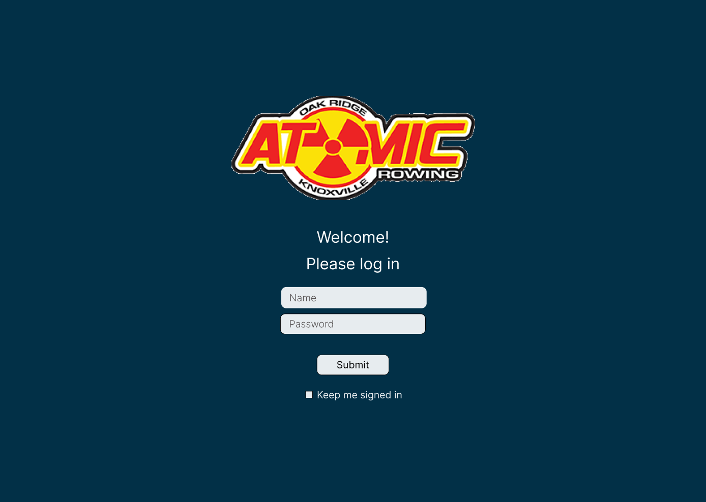
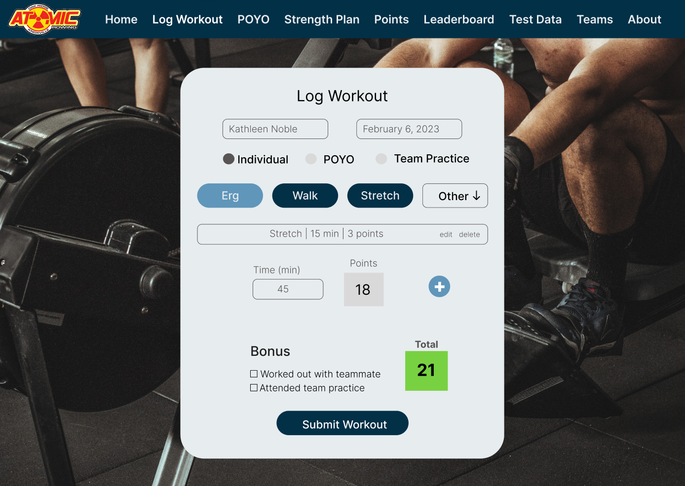

# This is a test build for the Winter Training League Rowing App
You can find the Figma wireframe [here](https://www.figma.com/file/PBPlhKGee9oeb6krDBdkJa/Atomic-Winter-Training?node-id=0%3A1&t=5wPoAiD29THKxmGf-1).

Project is still in progress.

 &nbsp; &nbsp; &nbsp; 

Users will log in and be able to record their activities. Workout data will be saved and compiled into various charts, tables, and graphs to display individual and team data.

## Built With React

## Optimizations

## Lessons Learned
